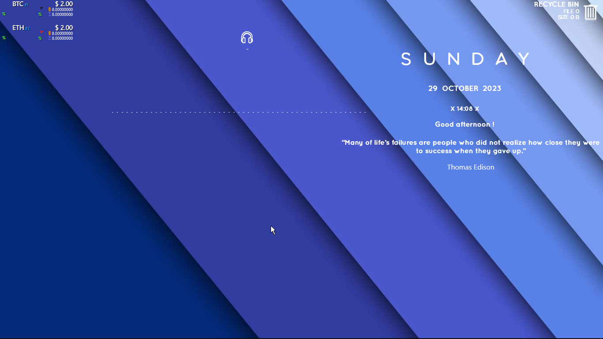
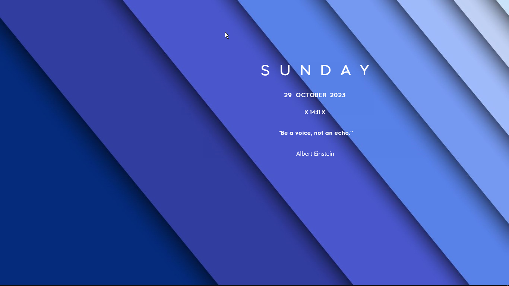

# Better Desktop | **V 0.1.0**

Better Desktop is a awesome widget that is compatible with the Windows operating system and can be integrated
with Rainmeter software. This widget provides various useful features, such as Clock, Quotes, and Notes.
With Better Desktop, you can quickly and easily access important information such as weather, date, and time, all in
a neatly organized display. Additionally, you can customize this widget to match your preferences. It also offers a
variety of themes that suit your color preferences. With its flexible and user-friendly capabilities, Better Desktop
is the right choice for Windows users looking to enhance their desktop experience.

## Requirement

**To use this widget, you need :**

- Rainmeter v5.18
- Windows 10
- Microsoft Visual C++ 2015
- 4 GB of RAM

## How to install

**To install this widget, follow this step :**

1. Install Rainmeter v5.18
2. Open Rainmeter
3. Go to your download folder, and open " Better Desktop x.x.x.rmskin (x.x.x is version)
4. Now the installer will running, click " Install " to start
5. The skin now installed. Open rainmeter windows and select " Better Desktop "
6. And then, select your skin to load (with .ini extension), and click load
7. Now you can use the widget

## Preview



## Contributor

**Without them, this project cant grow**

### Poiru ( Rainmeter Main Developer )

### Connect - R (Mond and Briberra Widget Creator. My inspiration)

## Major News

**Our Next Plan :** We will make this widget for Android, but we will use KWGT

**Next Version is Major Update :** In next update (0.2.0), we will add more feature in this widget. we will add Weather Info, Fixing Notes, and many more !

***View more news in :***
- [Our Blog]()
- [Our Discord (on #betterdesktop channel)]()

#  Useful Links

## License
